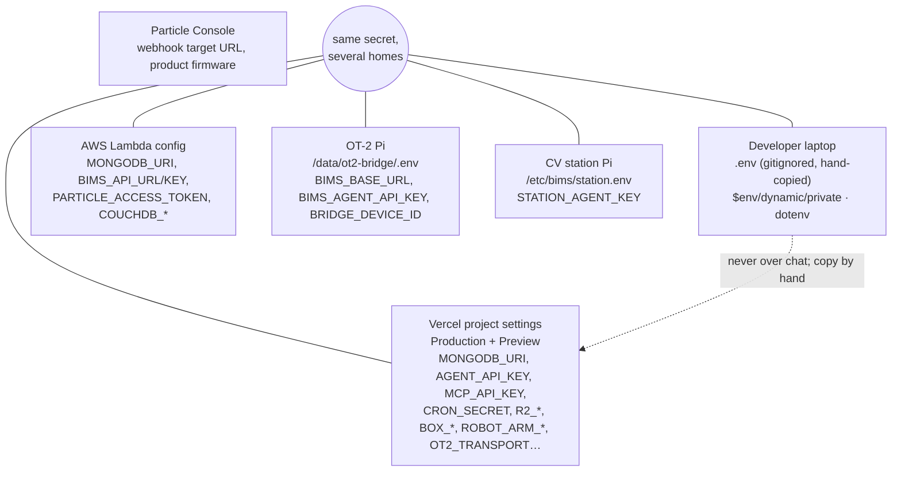
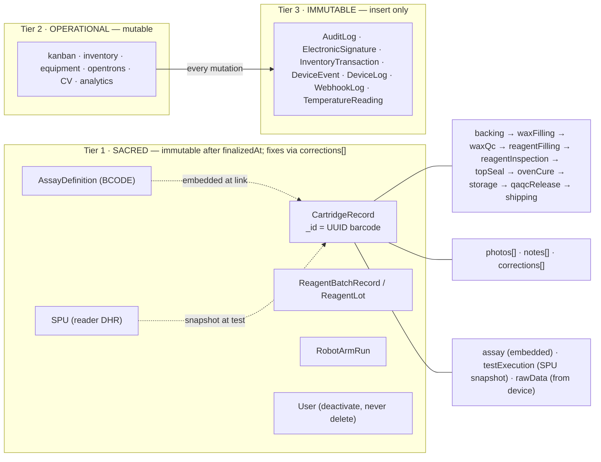
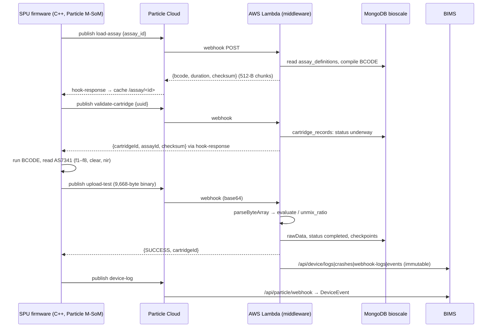
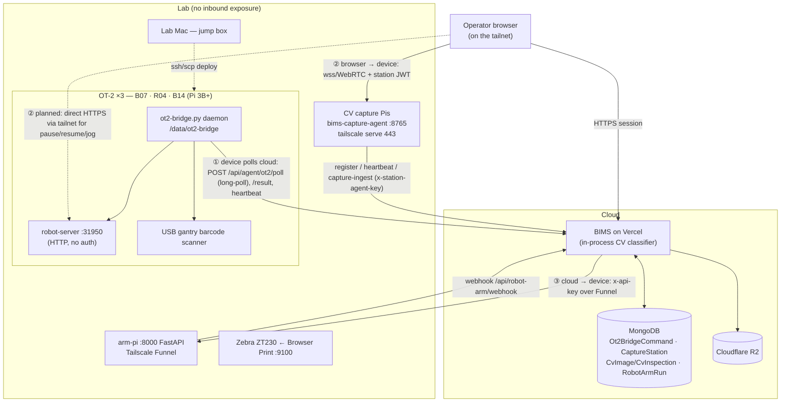
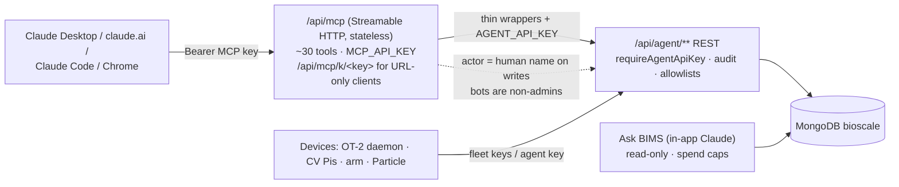
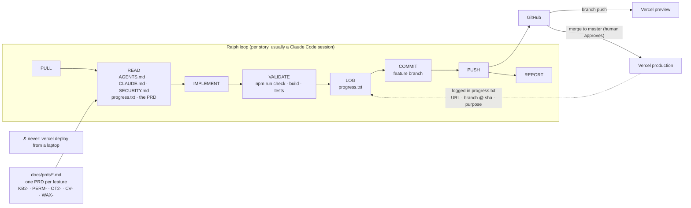

# INFRA-101 — Diagram Pack

Eight diagrams, one per module. Each has (a) a **mermaid source** you can render right now (GitHub, VS Code, Claude artifacts, mermaid.live) and (b) an **image-generation prompt** for Claude Design / Nano Banana when you want a polished slide. Keep the prompt's structure verbatim — the value is in the labels and directions, not the styling.

Shared style line for every image prompt (prepend it):
> Clean technical architecture diagram, flat vector style, white background, 16:9, thin dark-grey connectors with arrowheads showing direction, rounded rectangles for systems, cylinder for databases, muted palette (slate grey, one accent teal for our code, one accent amber for third-party clouds, one accent green for lab hardware), sans-serif labels, no decorative icons, no people, no gradients. Every label must be legible at slide size.

---

## Diagram 1 — The map: three repos, one database

```mermaid
flowchart LR
  subgraph Cloud["Cloud"]
    BIMS["BIMS<br/>Bioscale_Operations_System_V2<br/>SvelteKit on Vercel<br/>(master = prod)"]
    RES["research-v2<br/>brevitest-research-v2<br/>SvelteKit on Vercel<br/>(main = prod)"]
    LAM["Device middleware<br/>AWS Lambda us-east-1<br/>(source in brevitest-device)"]
    PART["Particle Cloud"]
    R2[("Cloudflare R2<br/>brevitest-cv")]
    MONGO[("MongoDB Atlas<br/>db: bioscale<br/>ONE database")]
    ANTH["Anthropic cloud<br/>Claude clients"]
  end
  subgraph Lab["Lab"]
    SPU["SPU readers<br/>Particle M-SoM firmware (C++)"]
    OT2["OT-2 robots x3<br/>(Pi inside)"]
    CV["CV capture stations<br/>(Pi + camera)"]
    ARM["Robot arm<br/>(arm-pi)"]
    MAC["Lab Mac<br/>jump box"]
  end
  BIMS <--> MONGO
  RES <--> MONGO
  LAM <--> MONGO
  SPU -- publish --> PART -- webhook --> LAM
  LAM -- hook-response --> PART -- --> SPU
  BIMS --> R2
  OT2 -- outbound poll --> BIMS
  CV -- push --> BIMS
  BIMS -- HTTPS --> ARM
  ANTH -- MCP /api/mcp --> BIMS
  MAC -. ssh/scp deploy .-> OT2
```

**Image prompt:** Show a top row labeled CLOUD and a bottom row labeled LAB. In CLOUD: three teal boxes "BIMS — Bioscale_Operations_System_V2 (SvelteKit on Vercel, master = prod)", "research-v2 — brevitest-research-v2 (SvelteKit on Vercel, main = prod)", "Device middleware — AWS Lambda us-east-1 (code lives in brevitest-device)"; one large central cylinder "MongoDB Atlas · db: bioscale · ONE DATABASE" with bidirectional arrows from all three boxes; amber boxes "Particle Cloud", "Cloudflare R2 (images)", "Anthropic cloud (Claude clients)". In LAB (green): "SPU readers — Particle M-SoM firmware (C++)", "OT-2 robots ×3 (Raspberry Pi inside)", "CV capture stations (Pi + camera)", "Robot arm (arm-pi)", "Lab Mac (jump box)". Arrows: SPU → Particle Cloud → Lambda (label "publish → webhook") and back ("hook-response"); OT-2 → BIMS labeled "outbound long-poll"; CV → BIMS "push"; BIMS → arm "HTTPS"; Anthropic → BIMS "MCP /api/mcp"; BIMS → R2. Title: "Three repos, one database".

---

## Diagram 2 — Request lifecycle inside a SvelteKit app on Vercel

```mermaid
sequenceDiagram
  participant B as Browser
  participant V as Vercel function (Node 22)
  participant H as hooks.server.ts
  participant P as +page.server.ts / +server.ts
  participant M as MongoDB (Mongoose)
  B->>V: GET /spu/... (cookie auth-session)
  V->>H: handleAuth
  H->>M: sessions.findById(sha256(token)) → users
  M-->>H: session + user
  H-->>P: event.locals.user
  P->>P: requirePermission(user,'x:read')
  P->>M: connectDB(); Model.find().lean()
  M-->>P: plain objects
  P-->>B: JSON.parse(JSON.stringify(data)) → Svelte page
  Note over P,M: mutations: validate → write → AuditLog.create() → redirect
```

**Image prompt:** A left-to-right pipeline of six rounded boxes with numbered steps: 1 "Browser (cookie auth-session)" → 2 "Vercel serverless function (Node 22, pdx1)" → 3 "hooks.server.ts: SHA-256 token → sessions → locals.user; redirect to /login if none" → 4 "+page.server.ts load / actions or +server.ts API" → 5 "requirePermission() → await connectDB() → Mongoose query .lean()" → 6 cylinder "MongoDB Atlas bioscale". A return arrow from 5 back to 1 labeled "JSON.parse(JSON.stringify()) → Svelte 5 page". A callout under step 4: "Every mutation: validate → write → AuditLog.create() → redirect". A small side badge: "Machines instead use requireAgentApiKey() on /api/agent/**". Title: "One request through BIMS".

---

## Diagram 3 — Where environment variables live



**Image prompt:** Five "homes" arranged around a central hub circle labeled "Same secret, several homes → rotation touches all of them". Homes: "Developer laptop — .env (gitignored, hand-copied) — read via $env/dynamic/private or dotenv"; "Vercel Project Settings — set for Production AND Preview, then redeploy"; "AWS Lambda function config (middleware)"; "Particle Console (webhook target, product firmware)"; "Raspberry Pis — /data/ot2-bridge/.env and /etc/bims/station.env". Under each, 3–4 example variable names in monospace: MONGODB_URI, AGENT_API_KEY, MCP_API_KEY, CRON_SECRET, R2_*, ROBOT_ARM_API_KEY, STATION_AGENT_KEY, PARTICLE_ACCESS_TOKEN. A red-outlined note: "Never send .env contents over chat". Title: "Environment variables: config and secrets out of code".

---

## Diagram 4 — Data tiers and the CartridgeRecord spine



**Image prompt:** Three horizontal bands. Top band (locked-padlock motif, teal): "TIER 1 · SACRED — mutable until finalizedAt, then append-only corrections[], never deleted" containing chips: CartridgeRecord, SPU (reader Device History Record), AssayDefinition (recipe + BCODE), ReagentBatchRecord / ReagentLot, RobotArmRun, User (deactivate, never delete). Middle band: "TIER 2 · OPERATIONAL — normal CRUD: kanban, inventory, equipment, opentrons, CV, analytics". Bottom band (stone texture): "TIER 3 · IMMUTABLE — insert only: AuditLog, ElectronicSignature, InventoryTransaction, DeviceEvent, DeviceLog, WebhookLog, TemperatureReading". To the right, an exploded view of one large document card "CartridgeRecord (_id = UUID barcode)" showing stacked sections: phase blocks in order backing → waxFilling → waxQc → reagentFilling → reagentInspection → topSeal → ovenCure → storage → qaqcRelease → shipping (each with operator + recordedAt), then arrays photos[], notes[], corrections[], then embedded assay, testExecution (SPU snapshot), rawData (from device). Dashed arrows: AssayDefinition → "embedded at link"; SPU → "snapshot at test". Arrow from Tier 2 to Tier 3 labeled "every mutation writes an AuditLog". Title: "Mongo tiers and the cartridge spine".

---

## Diagram 5 — Device data path



**Image prompt:** Left-to-right chain of five boxes: green "SPU reader — C++ firmware on Particle M-SoM v84 (never speaks HTTP)" → amber "Particle Cloud (webhooks + hook-response topics + OTA)" → teal "AWS Lambda middleware — index.mjs / db-adapter.mjs / evaluate.mjs / unmix_ratio.mjs" → cylinder "MongoDB bioscale · cartridge_records · assay_definitions (CouchDB legacy fallback, dashed)" and a fifth teal box "BIMS — /api/particle/webhook, /api/device/* (immutable DeviceEvent/DeviceLog/DeviceCrash/WebhookLog)". Forward arrows carry event names stacked: "load-assay · validate-cartridge · upload-test (9,668-byte binary) · reset-cartridge · device-log". A return arrow from Lambda back to device labeled "hook-response {deviceId}/hook-response/{event}, 512-byte chunks". Three callouts: "Assay = id + BCODE + duration; downloaded once, cached on flash"; "Result computed in the middleware — device sends raw counts"; "The cartridge record IS the test record (rawData)". Title: "From cartridge scan to result".

---

## Diagram 6 — Lab hardware topology: three control-plane patterns



**Image prompt:** Top: cloud region with teal "BIMS on Vercel (runs the CV classifier in-process)", cylinder "MongoDB (Ot2BridgeCommand queue, CaptureStation, CvImage/CvInspection, RobotArmRun)", cylinder "Cloudflare R2 (images)". Middle-left: "Operator browser (on the tailnet)". Bottom: green lab region titled "LAB — nothing exposed inbound; Vercel cannot reach the LAN" containing: a cluster "OT-2 ×3 (B07 · R04 · B14) — Raspberry Pi 3B+ inside: ot2-bridge.py daemon → robot-server :31950 (no auth) + USB gantry barcode scanner"; "CV capture stations — Pi + USB camera + scanner + LED, agent :8765 behind tailscale serve 443"; "arm-pi — SO-ARM101, FastAPI :8000, Tailscale Funnel"; "Lab Mac — jump box (ssh/scp deploys)"; "Zebra ZT230 via Browser Print localhost:9100". Draw three numbered, differently-dashed arrow styles and a legend: ① DEVICE POLLS CLOUD — solid arrow from OT-2 daemon UP to BIMS "long-poll POST /api/agent/ot2/poll → claim command → relay to :31950 → POST /result; heartbeat 10 s"; ② BROWSER → DEVICE OVER TAILNET — arrow from browser to CV Pi "wss/WebRTC + station-signed JWT" plus a dotted arrow browser → robot-server "planned OT2-TAILNET: pause/resume/jog direct, queue fallback"; also CV Pi → BIMS "register/heartbeat/capture-ingest with x-station-agent-key"; ③ CLOUD → DEVICE — arrow BIMS → arm-pi "x-api-key over Funnel" and return "webhook /api/robot-arm/webhook". Title: "Three ways the lab talks to the cloud".

---

## Diagram 7 — Agents talking to BIMS



**Image prompt:** Left: amber "Claude clients — Desktop, claude.ai, Claude Code, Chrome". Arrow "Authorization: Bearer <MCP_API_KEY>" into teal box "BIMS MCP server /api/mcp — Streamable HTTP, stateless per request, ~30 tools (kanban-first)". Arrow labeled "every tool is a thin wrapper → internal call with AGENT_API_KEY" into a wider teal box "Agent API /api/agent/** — requireAgentApiKey, audit logging, allowlists (single chokepoint)". From below, green "Devices: OT-2 daemon, CV Pis, robot arm, Particle webhooks" arrow "per-fleet keys" into the same Agent API box. Agent API → cylinder "MongoDB bioscale". A separate teal box "Ask BIMS (Claude in the app) — read-only across both apps' collections, daily spend caps" with its own arrow to the cylinder. A rules panel: "Bots are permanent non-admins · write tools require actor (a human's name; attribution not authority) · dual-identity audit log · devices carry no permissions". Title: "How agents and machines reach BIMS".

---

## Diagram 8 — How we build: Ralph loop and the deploy path



**Image prompt:** A circular loop of eight nodes with arrows: PULL → READ (AGENTS.md, CLAUDE.md, SECURITY.md, progress.txt, the PRD) → IMPLEMENT → VALIDATE (npm run check, npm run build, contract/unit tests) → LOG (progress.txt heartbeat) → COMMIT (feature branch) → PUSH → REPORT, labeled "Ralph loop — how each story gets built (Claude Code + human)". Feeding into READ from the left: a document stack "docs/prds/ — one PRD per feature (KB2-, PERM-, OT2-, CV-, WAX-…) with Goal / Facts / Steps / Acceptance". Exiting from PUSH to the right: "GitHub" splitting into "Vercel preview (every branch push)" and, through a gate icon labeled "human approval, merge to master", "Vercel production". A dotted line from production back to LOG: "every deployment logged: URL, branch @ short-sha, purpose". A crossed-out box: "vercel deploy from a laptop — never (untraceable)". Small side note: "parallel workstreams = git worktrees; .env copied by hand". Title: "The docs drive the agents".
